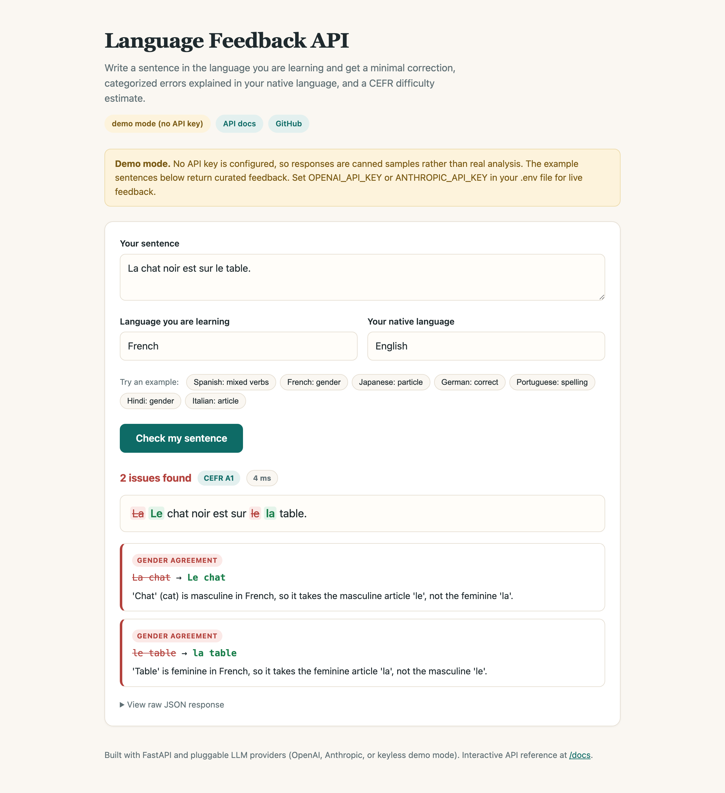

# LLM Multilingual Feedback API

[](https://github.com/akallam04/LLM-Multilingual-Feedback-API/actions/workflows/ci.yml)

A FastAPI service plus web demo that gives language learners structured feedback on their writing. Send a sentence in the language you are studying and get back a minimal correction, categorized errors explained in your native language, and a CEFR difficulty estimate.

The LLM backend is pluggable: OpenAI, Anthropic, or a keyless demo mode, selected by environment variable. Raw model output is never trusted: every response passes through a normalization and validation layer before it reaches the client.



## Try it in 60 seconds (no API key needed)

```bash
git clone https://github.com/akallam04/LLM-Multilingual-Feedback-API.git
cd LLM-Multilingual-Feedback-API

python3 -m venv .venv && source .venv/bin/activate
pip install -r requirements.txt

uvicorn app.main:app --reload
```

Open http://127.0.0.1:8000 and click any example sentence. With no API key configured the server starts in demo mode: the curated example sentences return real feedback payloads, the UI shows a banner so canned output is never mistaken for live analysis, and everything else about the system (API contract, validation, error handling) behaves exactly as in production.

Or with Docker:

```bash
docker compose up --build
```

## Run it with a real model

```bash
cp .env.example .env
# put OPENAI_API_KEY or ANTHROPIC_API_KEY in .env
uvicorn app.main:app --reload
```

| Provider | Default model | JSON strategy |
|---|---|---|
| `openai` | gpt-4o-mini | JSON mode (`response_format: json_object`) |
| `anthropic` | claude-haiku-4-5 | Structured outputs (response schema enforced server side) |
| `mock` | none | Deterministic canned responses, no key needed |

The provider is auto-detected from whichever key is present, or pinned explicitly with `LLM_PROVIDER`. The model is overridable with `LLM_MODEL`, and `LLM_TIMEOUT_SECONDS` / `LLM_MAX_RETRIES` control upstream behavior. Both real providers default to small fast models on purpose: for this task, a lightweight model behind a strong prompt and a validation layer is a better cost and latency tradeoff than a frontier model without guardrails.

## API

Interactive reference lives at `/docs` (Swagger UI) once the server is running.

### `POST /feedback`

```bash
curl -s http://127.0.0.1:8000/feedback \
  -H "Content-Type: application/json" \
  -d '{
    "sentence": "Yo soy fue al mercado ayer.",
    "target_language": "Spanish",
    "native_language": "English"
  }'
```

```json
{
  "corrected_sentence": "Yo fui al mercado ayer.",
  "is_correct": false,
  "errors": [
    {
      "original": "soy fue",
      "correction": "fui",
      "error_type": "conjugation",
      "explanation": "You mixed two verb forms. 'Soy' is the present tense of 'ser' (to be), and 'fue' is the past tense of 'ir' (to go). Since you're talking about going to the market yesterday, you only need 'fui' (I went)."
    }
  ],
  "difficulty": "A2"
}
```

`error_type` is one of 12 fixed categories (grammar, spelling, word_choice, punctuation, word_order, missing_word, extra_word, conjugation, gender_agreement, number_agreement, tone_register, other) and `difficulty` is a CEFR level (A1 to C2). The full request and response contracts are versioned as JSON Schemas in [`schema/`](schema/) and enforced by tests.

### `GET /health`

Reports liveness plus the active provider, model, and whether a key is configured, without leaking secrets.

### Error handling

Upstream failures surface as clean JSON (`{"detail": "..."}`) with meaningful status codes instead of stack traces:

| Status | Meaning |
|---|---|
| 422 | Request failed validation (empty sentence, oversized input, missing fields) |
| 502 | Provider unreachable, returned a server error, or produced unusable output twice |
| 503 | Provider API key missing/invalid, or provider rate limit hit |
| 504 | Provider timed out |

## How it works

```
client -> FastAPI route -> provider (OpenAI | Anthropic | Mock)
                               |
                        raw JSON payload
                               |
                  normalization + consistency rules
                               |
                  constrained Pydantic validation
                               |
                        FeedbackResponse
```

```
app/
  main.py        FastAPI app: routes, error handlers, timing middleware, demo UI
  config.py      Env-driven settings and provider resolution
  providers.py   Provider abstraction: OpenAI, Anthropic, Mock + error taxonomy
  prompts.py     System prompt and user message construction
  feedback.py    Normalization, consistency enforcement, validation
  models.py      Constrained request/response models
  static/        Self-contained demo UI (vanilla HTML/CSS/JS, no build step)
schema/          JSON Schema contracts for request and response
evals/           Labeled multilingual dataset + eval runner
tests/           Unit, provider, API, schema, and integration tests
```

### The reliability layer

A raw LLM response is treated as untrusted input. After generation, before the client sees anything:

- near-miss enum values are mapped to allowed ones (`verb_conjugation` becomes `conjugation`, `b1` becomes `B1`), unknown categories fall back to `other`
- consistency rules are enforced: if `is_correct` is true the corrected sentence must equal the input and errors must be empty; if errors exist `is_correct` must be false
- missing explanations get safe fallback text; malformed error entries are dropped
- markdown fences and surrounding prose around the JSON are tolerated, and a response that still is not parseable is retried once
- the final payload must pass constrained Pydantic validation or the request fails loudly

The Anthropic path additionally uses structured outputs, so the JSON shape is guaranteed by the API itself; the normalization layer then acts as defense in depth and keeps all three providers behind one identical contract.

### Design decisions

- **Minimal corrections, not rewrites.** The prompt optimizes for preserving the learner's meaning and style, because feedback that rewrites your sentence teaches you nothing.
- **One interface, three backends.** Providers differ in SDKs, JSON strategies, and failure modes; the rest of the app sees a single `complete(request) -> dict` and a shared error taxonomy. Adding a fourth provider is one class.
- **A demo mode is a feature, not a shortcut.** Anyone can clone the repo and use the product in under a minute, CI can exercise the full HTTP surface offline, and the UI is explicit about when responses are canned.
- **Errors are part of the API contract.** A missing key, a rate limit, and a timeout are different problems; clients get different status codes and actionable messages for each.

## Evals

`evals/dataset.json` holds 34 labeled cases across 10 languages (Spanish, French, German, Portuguese, Italian, Japanese, Hindi, Korean, Telugu, English), mixing sentences with known errors, correct sentences, and non-Latin scripts. Each case is labeled with acceptable corrections and acceptable error categories, since multiple labels can be defensible for one mistake.

```bash
make eval   # or: python -m evals.run
```

The runner measures schema validity, is_correct accuracy, correction match rate, error category match rate, and latency percentiles, with a per-language breakdown, and writes a markdown report to `evals/results.md`. Results depend on which provider and model you run against, so the report is generated locally rather than checked in. Running the full set against gpt-4o-mini or claude-haiku-4-5 costs well under one cent.

## Development

```bash
pip install -r requirements-dev.txt

make test    # 55 offline tests: unit, provider, API, schema (+ 4 integration tests that need a key)
make lint    # ruff
make dev     # uvicorn with reload
```

Tests run fully offline against the mock provider, including the provider error mapping (simulated 401/429/500 responses) and the HTTP error contract. CI runs lint and the offline suite on Python 3.11 and 3.12 on every push.

## Project history

This started as a one-week take-home for a Gen AI internship assessment: a FastAPI endpoint backed by gpt-4o-mini with output normalization and a test suite. I kept building after the deadline because the unglamorous parts of LLM engineering turned out to be the interesting ones. Since then it has gained the provider abstraction with Anthropic structured outputs, the keyless demo mode, the web UI, the error taxonomy with proper HTTP mapping, the eval harness, and CI.
